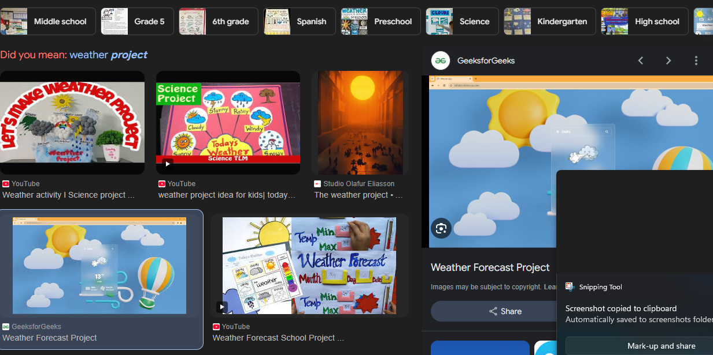
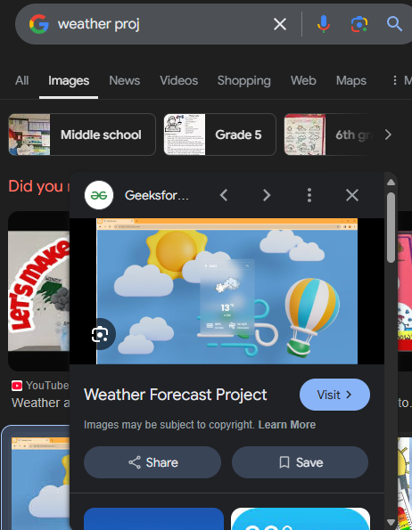

# head 1
## head2
### head 3
#### List
- project1
    - assignment 1
    - assignment 2
    - assignment 3

- project 2
- project 3
#### ordered list
1. project 1
2. project 2
3. project 3

_italics_  
[google](https://www.google.com)
# flutter ecom website
## this is my fullstack project and .....
### technologies used
- Html
- css
- mongo db
- dart
- js

[project name]()

### screenshots
#### this project is responsive to all types of ......

## full screen

## mobile screen
